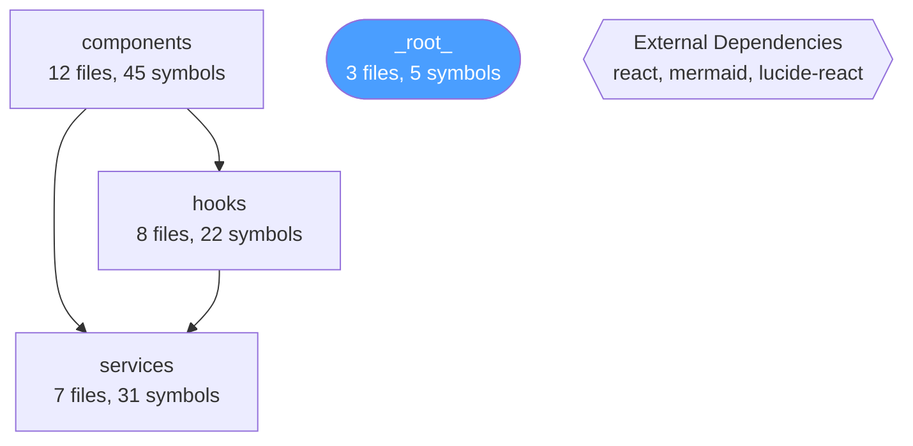
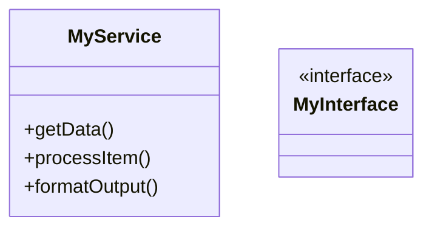

# Codebase-to-Diagrams : comment ca marche

## Vue d'ensemble

La feature analyse un repo entier via le File System Access API et genere automatiquement des diagrammes Mermaid navigables, **sans LLM** — tout est du code pur deterministe.

Le resultat : une hierarchie de diagrammes a 3 niveaux relies par des NodeLinks pour naviguer en drill-down.

```
Niveau 1 : System Overview       (1 diagramme)
    |
    v  clic sur un module
Niveau 2 : Module Detail          (1 par module significatif)
    |
    v  clic sur un fichier
Niveau 3 : File Detail            (1 par fichier avec 3+ symboles)
```

---

## Pipeline en 5 etapes

```
[Repo sur disque]
       |
       v
  1. SCAN          codebaseAnalyzerService.analyzeCodebase()
       |            - Liste recursivement les fichiers code (.ts, .py, .js, etc.)
       |            - Pour chaque fichier : extraire symboles, imports, exports
       |            - Respecte le ScanConfig (include/exclude paths)
       v
  CodebaseAnalysis { modules[], externalDeps[], entryPoints[], totalFiles, totalSymbols }
       |
       v
  2. GENERATE      diagramGeneratorService.generateAllDiagrams()
       |            - L1 : 1 flowchart avec modules comme noeuds, deps comme fleches
       |            - L2 : 1 flowchart par module (fichiers comme noeuds, imports internes)
       |            - L3 : classDiagram ou flowchart par fichier (classes, fonctions)
       |            - Cree les NodeLinks entre niveaux
       v
  DiagramGenerationResult { diagrams[], nodeLinks[] }
       |
       v
  3. CREATE        useCodebaseImport.startImport()
       |            - Cree un dossier "Generated: {repoName}"
       |            - Cree les objets Diagram dans le state React
       v
  4. LINK
       |            - Applique les NodeLinks aux diagrammes sources
       |            - L1[module_node] --> L2[module_diagram]
       |            - L2[file_node]   --> L3[file_diagram]
       v
  5. NAVIGATE
                    - L'utilisateur est amene au System Overview
                    - Clic sur un badge bleu = drill-down vers le sous-diagramme
```

---

## Les 3 niveaux en detail

### Niveau 1 — System Overview

Un seul diagramme `flowchart TD` qui montre la structure haut niveau du projet.

| Element              | Representation                          |
|----------------------|-----------------------------------------|
| Module (dossier)     | Noeud rectangle `[nom\nX files, Y symbols]` |
| Module entry-point   | Noeud stadium `([nom...])` + couleur bleue |
| Dependance croisee   | Fleche `-->` entre modules               |
| Deps externes        | Noeud hexagonal `{{External Deps}}`      |

**Regroupement** : les fichiers sont groupes par dossier de premier niveau. Les fichiers a la racine vont dans un module `(root)`.

**Exemple genere :**


### Niveau 2 — Module Detail

Un diagramme par module ayant plus d'un fichier significatif (fichiers avec au moins 1 symbole ou export).

| Element              | Representation                          |
|----------------------|-----------------------------------------|
| Fichier              | Rectangle `[nom.ts\n3 fns]`             |
| Fichier avec classes | Double rectangle `[[nom.ts\n2 classes]]` |
| Entry-point          | Stadium `([nom.tsx])`                    |
| Import interne       | Fleche `-->` entre fichiers              |
| Sous-dossier         | `subgraph` si >1 fichier dans le sous-dossier |

**Resolution des imports** : pour chaque `import { X } from './foo'` dans un fichier, on cherche si `foo.ts`, `foo.tsx`, `foo.js` ou `foo/index.ts` existe dans le module. Si oui, on trace une fleche.

### Niveau 3 — File Detail

Un diagramme par fichier ayant 3+ symboles. Le type de diagramme depend du contenu :

**Fichier avec classes** → `classDiagram`


**Fichier sans classes** → `flowchart TD` avec fonctions comme noeuds
```mermaid
flowchart TD
    parseInput([parseInput\n(fn)])
    validate[validate\n(fn)]
    transform[transform\n(fn)]
    parseInput --> validate
    style parseInput fill:#4a9eff,color:#fff
```

Les fonctions exportees sont en bleu (stadium shape), les internes en rectangle simple.

---

## Extraction des imports (codeParserService)

### JS / TS
```
import X from 'Y'              → { name: "X", source: "Y", isDefault: true }
import { A, B } from 'Y'       → 2 imports, isDefault: false
import * as X from 'Y'         → { name: "X", isDefault: true }
require('Y')                    → { name: "Y", isDefault: true }
```

### Python
```
import os                       → { name: "os", source: "os", isDefault: true }
from pathlib import Path        → { name: "Path", source: "pathlib", isDefault: false }
from . import utils             → { name: "utils", source: ".", isExternal: false }
```

**`isExternal`** : `true` si le source ne commence pas par `.` ou `/` (= package npm ou module Python standard).

---

## Limites de noeuds

Chaque diagramme est plafonne a **25 noeuds** pour rester lisible :

- L1 : si >24 modules, les derniers sont remplaces par un noeud `...and N more modules`
- L2 : seuls les fichiers significatifs sont montres, puis `...and N more files`
- L3 : les symboles sont coupes a 24, puis `...and N more`
- Les methodes dans un classDiagram sont coupees a 10 par classe

---

## Fichiers impliques

```
services/
  codebaseAnalyzerService.ts    ← Scan + analyse + groupement en modules
  diagramGeneratorService.ts    ← Generation Mermaid pure (L1, L2, L3)
  codeParserService.ts          ← extractImports(), extractExports() (ajoutes)
  fileSystemService.ts          ← Acces fichiers (existant, reutilise)

hooks/
  useCodebaseImport.ts          ← Orchestration pipeline + progress
  useFolderHandlers.ts          ← createFolderProgrammatic() (ajoute)
  useAppState.ts                ← isCodebaseImportOpen (ajoute)

components/
  CodebaseImportModal.tsx       ← UI modale avec progression
  RepoManager.tsx               ← Bouton "Generate Diagrams" (ajoute)
  ModalManager.tsx              ← Branchement de la modale (modifie)

App.tsx                         ← Instanciation du hook + passage des props

types.ts                        ← FileImport, AnalyzedFile, CodebaseModule,
                                   CodebaseAnalysis, DiagramGenerationResult,
                                   CodebaseImportStep, CodebaseImportProgress
```

---

## Parcours utilisateur

1. Ouvrir **Repo Manager** depuis la sidebar
2. Connecter un repo (Open Directory)
3. Cliquer **Generate Diagrams** (bouton vert)
4. La modale s'ouvre → choisir le repo → cliquer **Generate Diagrams**
5. La barre de progression avance : Scanning → Generating → Creating → Linking → Done
6. Un dossier **"Generated: {nom}"** apparait dans la sidebar
7. Le System Overview (L1) s'affiche automatiquement
8. Cliquer sur les badges bleus pour naviguer L1 → L2 → L3
9. Fil d'Ariane (breadcrumb) en haut pour remonter
