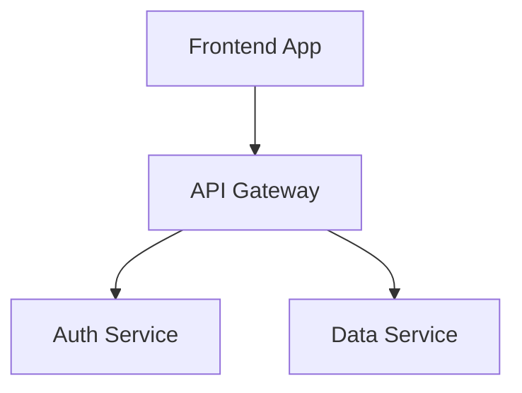
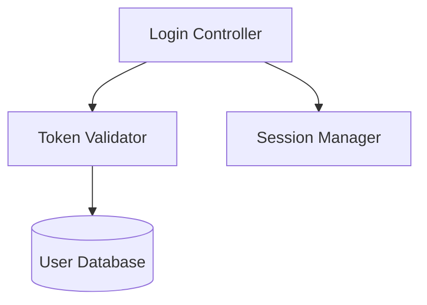

# Blueprint

**Living Architecture Diagrams That Sync With Reality**

Blueprint is a web-based tool for software architects, tech leads, and developers to create, visualize, and maintain living architecture diagrams that stay synchronized with their codebase. Transform static diagrams into dynamic, trustworthy sources of truth that evolve alongside your code.


## ✨ Key Features

### 🔍 Multi-Level Zoom Navigation

- **Unlimited hierarchical navigation** from system-level architecture down to individual function implementations
- **Visual badges** indicate elements with sub-diagrams
- **Breadcrumb navigation** shows your current position in the hierarchy
- **Smooth transitions** between diagram levels

### 🔗 Node Linking System

- **Connect diagram elements** to other diagrams for deep-dive exploration
- **Double-click navigation** to zoom into linked diagrams
- **Visual indicators** (blue 3D badges) show which nodes have links
- **Hover effects** highlight interactive nodes

### 🎨 Professional Diagram Editor

- **Live preview** with Mermaid.js rendering
- **Split-pane interface** for simultaneous editing and viewing
- **Syntax highlighting** with JetBrains Mono font
- **Error detection** with helpful feedback

### 🤖 AI-Powered Generation

- **Gemini 2.0 Flash integration** for diagram generation
- **Natural language prompts** to create complex diagrams
- **Intelligent suggestions** based on your requirements

### 📁 Advanced Organization

- **Multiple workspaces** for different projects
- **Folder hierarchy** to organize diagrams
- **Drag-and-drop** diagram management
- **Import/Export** diagrams as `.mermaid` files or ZIP archives

### 💾 Persistent Storage

- **Browser-based storage** using IndexedDB
- **Auto-save** with visual feedback
- **No server required** - works completely offline

## 🚀 Getting Started

### Prerequisites

- Modern web browser (Chrome, Edge, or Safari recommended)
- Node.js 18+ (for development)

### Installation

```bash
# Clone the repository
git clone https://github.com/nathanf22/blueprint.git

# Navigate to the project directory
cd blueprint/MermaidViz

# Install dependencies
npm install

# Start the development server
npm run dev
```

The application will be available at `http://localhost:3000`

### Quick Start Guide

1. **Create Your First Diagram**
   - Click "+ New Diagram" in the sidebar
   - Enter your Mermaid code in the editor
   - See the live preview on the right

2. **Link Diagrams Together**
   - Create multiple diagrams for different system levels
   - Click "Manage Node Links" button
   - Select a node and link it to another diagram
   - Double-click the node to navigate to the linked diagram

3. **Use AI Generation**
   - Click "Ask AI" in the top navigation
   - Describe the diagram you want to create
   - Review and refine the generated Mermaid code

4. **Organize Your Work**
   - Create folders to group related diagrams
   - Use workspaces to separate different projects
   - Export diagrams for sharing or backup

## 📖 Usage Examples

### Creating a Multi-Level Architecture

**System Level (Diagram 1):**



**Auth Service Detail (Diagram 2):**



Link the "Auth Service" node in Diagram 1 to Diagram 2, then double-click to navigate between levels.

### Supported Diagram Types

Blueprint supports all Mermaid.js diagram types:

- **Flowcharts** - System architecture, process flows
- **Sequence Diagrams** - API interactions, user flows
- **Class Diagrams** - Object-oriented design
- **State Diagrams** - State machines, workflows
- **ER Diagrams** - Database schemas
- **Gantt Charts** - Project timelines
- **And more** - See [Mermaid.js documentation](https://mermaid.js.org/)

## 🎯 Product Vision

Blueprint addresses the critical challenge of keeping architecture documentation synchronized with code in the age of AI-powered development. As developers increasingly focus on architecture design and code review rather than implementation, Blueprint provides:

- **Single Source of Truth** - Diagrams that reflect actual system architecture
- **Infinite Zoom** - Navigate from 30,000-foot view to implementation details
- **AI-Accelerated Workflow** - Generate and update diagrams with natural language
- **Collaboration Ready** - Share and discuss architectural decisions

## 🛣️ Roadmap

### ✅ Phase 1: Foundation (Current - MVP)

- [x] Mermaid diagram editor with live preview
- [x] Multi-level navigation with badges and zoom
- [x] Breadcrumb navigation
- [x] Workspace and folder management
- [x] AI-powered diagram generation
- [x] Import/Export functionality

### 🔄 Phase 2: Code Integration (In Progress)

- [ ] File System Access API implementation
- [ ] Bidirectional code-diagram linking
- [ ] Monaco Editor integration for code viewing
- [ ] Multi-repository support

### 📅 Phase 3: Intelligence Layer (Planned)

- [ ] Code scanning and divergence detection
- [ ] Automated synchronization suggestions
- [ ] LLM integration layer (Claude, Gemini, OpenAI)
- [ ] Visual diff view for changes

### 🌐 Phase 4: Collaboration (Planned)

- [ ] Real-time multi-user editing (CRDT with Yjs)
- [ ] Element-specific comment threads
- [ ] Permission system (view, comment, edit)
- [ ] Offline-first with sync

### 🎨 Phase 5: Polish & Advanced Features (Planned)

- [ ] Semantic search
- [ ] Auto-tagging and smart organization
- [ ] Version history and timeline view
- [ ] Diagram templates library
- [ ] Advanced export options (PDF, HTML)

## 🏗️ Architecture

### Technology Stack

| Layer              | Technology              |
| ------------------ | ----------------------- |
| Frontend Framework | React + TypeScript      |
| Diagram Rendering  | Mermaid.js v11          |
| Local Storage      | IndexedDB               |
| AI Integration     | Google Gemini 2.0 Flash |
| Styling            | Tailwind CSS            |
| Fonts              | Inter, JetBrains Mono   |

### Project Structure

```
MermaidViz/
├── components/          # React components
│   ├── Editor.tsx      # Code editor pane
│   ├── Preview.tsx     # Diagram preview with navigation
│   ├── Sidebar.tsx     # Workspace and diagram list
│   └── ...
├── services/           # Business logic
│   ├── storageService.ts    # IndexedDB persistence
│   ├── svgParserService.ts  # SVG manipulation for badges
│   └── aiService.ts         # Gemini AI integration
├── hooks/              # Custom React hooks
│   └── useNavigation.ts     # Zoom/pan controls
├── types/              # TypeScript type definitions
├── App.tsx             # Main application component
└── index.html          # Entry point
```

## 🤝 Contributing

Contributions are welcome! Please feel free to submit a Pull Request.

### Development Guidelines

1. **Code Style** - Follow TypeScript best practices
2. **Components** - Keep components focused and reusable
3. **Types** - Use TypeScript types for all data structures
4. **Testing** - Add tests for new features (coming soon)

### Running Locally

```bash
npm run dev          # Start development server
npm run build        # Build for production
npm run preview      # Preview production build
```

## 📄 License

This project is licensed under the MIT License - see the LICENSE file for details.

## 🙏 Acknowledgments

- **Mermaid.js** - Powerful diagram generation library
- **Google Gemini** - AI-powered diagram generation
- **React** - UI framework
- **Tailwind CSS** - Utility-first CSS framework

## 📞 Support

For questions, issues, or feature requests, please open an issue on GitHub.

---

**Blueprint** - Making architecture diagrams that actually stay up to date.
