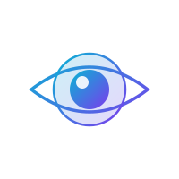

<p align="center">
  
</p>

<h1 align="center">BlueLens</h1>

<p align="center"><strong>Living Architecture Diagrams That Sync With Reality</strong></p>

<p align="center">
  
  
  
  
</p>

BlueLens is an open-source platform for creating, visualizing, and maintaining architecture diagrams that stay synchronized with your codebase. It transforms static diagrams into dynamic, navigable maps of your system — from 30,000-foot views down to individual functions.

> **BlueLens Cloud** — A hosted version with collaboration, cloud storage, and team features is coming soon. This repository is the open-source core.

---

## Features

### Diagram Editor
- Live Mermaid preview with split-pane editing
- All Mermaid diagram types (flowchart, sequence, class, ER, state, gantt, ...)
- AI-powered generation from natural language prompts
- Diagram analysis with anti-pattern detection (fan-out, god nodes, circular deps)

### Multi-Level Navigation
- Link any diagram node to another diagram for drill-down exploration
- Visual badges on nodes that have sub-diagrams (blue) or code links (green)
- Breadcrumb trail tracks your position in the hierarchy
- Double-click to zoom in, breadcrumb to zoom out

### Code Integration
- Connect diagrams to local repositories via the File System Access API
- Link individual nodes to specific files and line ranges
- Read-only Monaco Editor panel for viewing linked source code
- Multi-repository support scoped to workspaces

### CodeGraph
- Automatic graph generation from a codebase — no manual diagramming needed
- Hierarchical model: System (D0) > Module (D1) > File (D2) > Symbol (D3)
- ViewLens system: switch between Component, Flow, and Domain perspectives
- Contextual flow detection with AI-generated sequence diagrams
- Smart functional grouping via LLM agent pipeline (with heuristic fallback)
- SHA-256 hash-based sync detection for code drift

### Intelligence Layer
- Multi-provider LLM support: **Gemini**, **OpenAI**, **Anthropic**
- AI chat panel for diagram modifications, conversions, and scaffolding
- Code scanning with divergence detection and typed sync suggestions
- Three sync modes: manual, semi-auto, auto
- Visual diff via Monaco DiffEditor
- Encrypted API key storage (AES-GCM + IndexedDB)

### Organization
- Workspaces and nested folders
- `.blueprint` export format preserving all metadata (comments, node links, folders)
- Legacy import support (.mmd, .mermaid, .txt, .zip)

---

## Getting Started

### Prerequisites

- **Node.js 18+**
- **Chromium-based browser** (Chrome, Edge, Brave) — required for the File System Access API

### Installation

```bash
git clone https://github.com/Nathanf22/BlueLens.git
cd BlueLens
npm install
npm run dev
```

Open [http://localhost:3000](http://localhost:3000).

### AI Features (optional)

AI-powered features (chat, code scanning, flow generation, smart grouping) require an API key. Copy `.env.example` to `.env` and fill in your key, or configure via the **AI Settings** panel in the app.

| Provider | Setup |
|----------|-------|
| Google Gemini | API key from [Google AI Studio](https://aistudio.google.com/) |
| OpenAI | API key from [OpenAI Platform](https://platform.openai.com/) |
| Anthropic | API key + CORS proxy (browser cannot call the API directly) |

---

## Architecture

This is a client-side-only React app. No backend, no router, no external state library. All data persists to `localStorage` and `IndexedDB`.

### Tech Stack

| Layer | Technology |
|-------|-----------|
| Framework | React 19 + TypeScript (strict) |
| Build | Vite |
| Diagrams | Mermaid.js v11 |
| Code Viewer | Monaco Editor |
| AI | Gemini SDK, OpenAI SDK, Anthropic (fetch) |
| Styling | Tailwind CSS (CDN) |
| Storage | localStorage + IndexedDB (encrypted) |

### Project Structure

```
BlueLens/
  App.tsx                    # Root orchestrator — composes hooks, passes props
  types.ts                   # All TypeScript interfaces
  components/                # React components (stateless — props only)
    CodeGraphPanel.tsx       # CodeGraph node tree, lens tabs, flow list
    CodeGraphVisualizer.tsx  # Force-directed graph + sequence diagrams
    AIChatPanel.tsx          # AI chat with suggestion chips
    ScanResultsPanel.tsx     # Code scan results and sync suggestions
    ProgressLogPanel.tsx     # Build-log panel for graph creation
    ...
  hooks/                     # Custom hooks (state + logic)
    useAppState.ts           # Central state: workspaces, diagrams, UI toggles
    useCodeGraph.ts          # CodeGraph state, lens switching, flow nav
    useLLMSettings.ts        # Encrypted LLM config storage
    useChatHandlers.ts       # AI chat sessions
    useScanHandlers.ts       # Code sync modes and suggestions
    ...
  services/                  # Pure services (no React dependency)
    codeGraphModelService.ts # CodeGraph CRUD, tree traversal, lens queries
    codeGraphRendererService.ts  # CodeGraph + ViewLens → Mermaid string
    codeGraphFlowService.ts  # AI flow generation pipeline
    codeGraphAgentService.ts # Two-agent LLM pipeline for smart grouping
    llmService.ts            # Unified multi-provider LLM interface
    codeScannerService.ts    # Divergence detection + sync suggestions
    ...
```

### Key Patterns

- **Props-only components** — state lives in hooks, composed in `App.tsx`, drilled via props
- **No context providers** — everything flows through the component tree
- **Service layer** — pure functions with no React dependency
- **Path alias** — `@/*` maps to the project root

---

## Roadmap

### Complete

- **Phase 1 — Foundation**: Mermaid editor, live preview, multi-level zoom navigation, badges, breadcrumbs, workspaces, folders, import/export, AI generation
- **Phase 2 — Code Integration**: File System Access API, code linking, Monaco viewer, multi-repo support, codebase-to-diagram generation
- **Phase 3 — Intelligence Layer**: Multi-provider LLM, AI chat, code scanning, divergence detection, sync modes, visual diff, diagram analysis, encrypted storage, CodeGraph with flows

### Planned

- **Phase 4 — Polish**: Semantic search, version history, diagram templates, advanced exports (PDF, HTML)

---

## Contributing

See [CONTRIBUTING.md](CONTRIBUTING.md) for setup instructions, architecture notes, and guidelines.

## Security

See [SECURITY.md](SECURITY.md) for the vulnerability disclosure policy.

## License

[MIT](LICENSE) — Copyright (c) 2026 Nathan Kamokoue

## Author

**Nathan Kamokoue** — [LinkedIn](https://www.linkedin.com/in/nathan-kamokoue-1289121b8/) | [X](https://x.com/KamokoueNathan)

---

**BlueLens** — Architecture diagrams that actually stay up to date.
